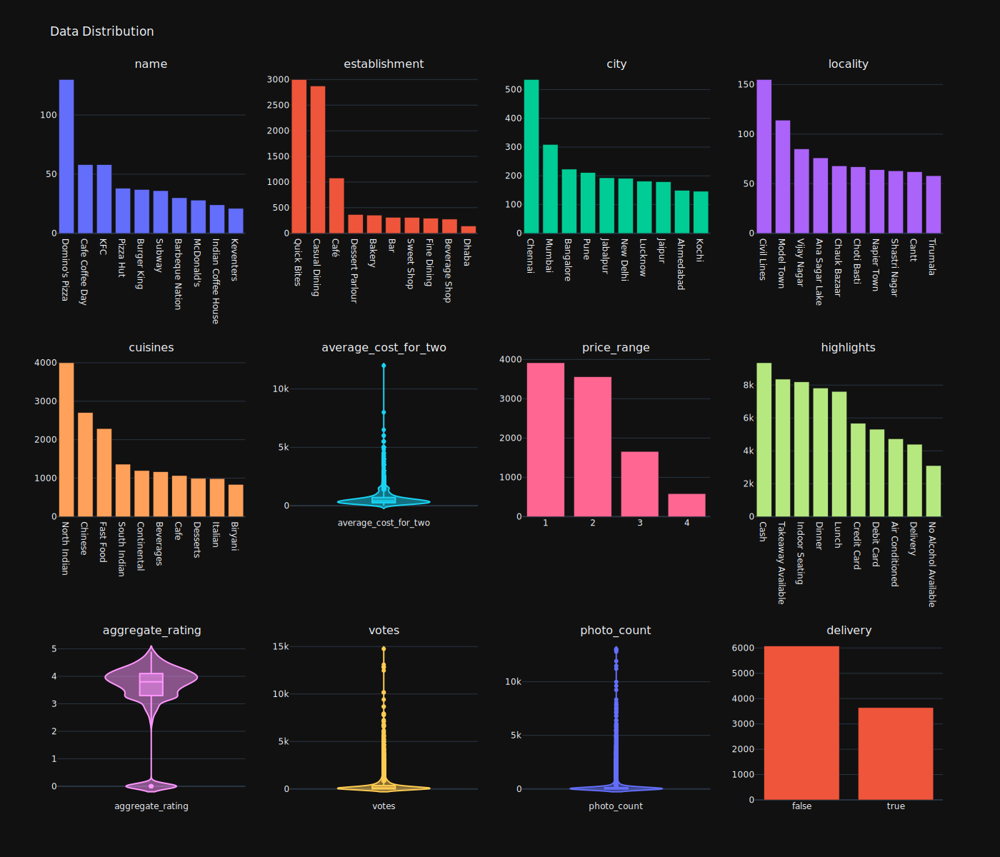
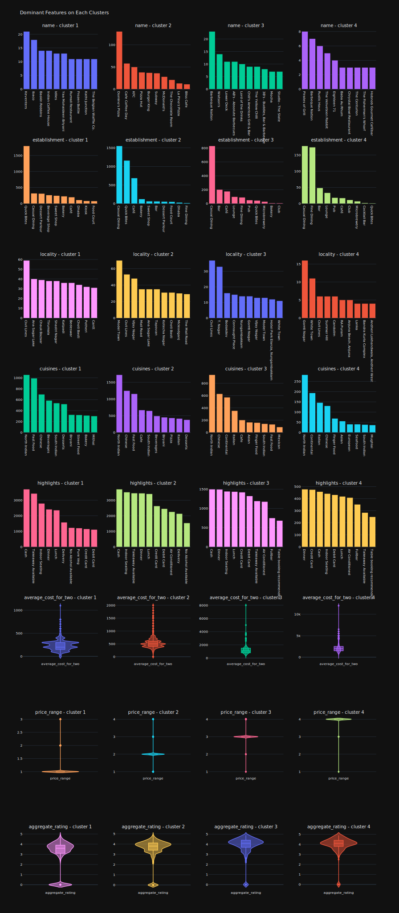
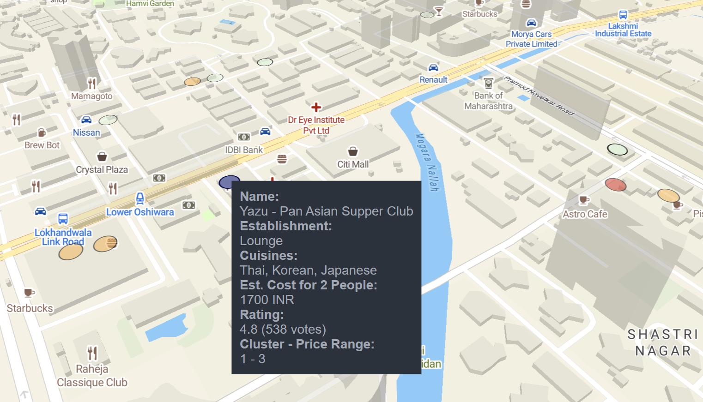

# Zomato Restaurant Recsys

This project uses [Zomato restaurant data](https://www.kaggle.com/datasets/rabhar/zomato-restaurants-in-india) to build a content-based recommendation system. It will show similar restaurants based on cuisines, establishment, etc.

Project stacks:
- Scikit Learn and Polars for preprocessing pipeline
- PyTorch for text embedding
- Plotly for quick EDA
- PyDeck for interactive map
- Qdrant for storing vector & similarity search

Important files:
- `clustering.ipynb`: Model building and EDA
- `recsys.ipynb`: Demo of PyDeck and Qdrant

## Setup

### Conda

1. Create a Conda environment: `conda create --name zomato python=3.12`
2. Check if the environment is listed: `conda info --envs`
3. Activate the environment: `conda activate zomato`
4. To automate Conda activation on VS Code:
    - Press Ctrl + Shift + P
    - Python: Select Interpreter
    - Select the `zomato` environment
5. Now everytime you open terminal, `zomato` will be activated (until you quit or switch project)
6. Install PyTorch (CUDA 12.4) dependencies: `pip install torch==2.4.1 torchvision==0.19.1 --index-url https://download.pytorch.org/whl/cu124`
7. Install other dependencies: `pip install -r requirements.txt`
8. To clean-up Conda environment: `conda remove --name zomato --all`

### Qdrant

1. Install Qdrant (either via Docker or natively)
2. Customize the `Makefile` and `local.yaml` file
3. Run `make qdrant` so that the notebook client can connect to it
4. Open the notebook (`recsys.ipynb`)

## Screenshots

  
Data Distribution

  

  
Cluster Result

  

  
2D PCA vs Real Restaurant Coordinates

  

  
Interactive Map Example

  

## Todo

- ~~Vocabulary builder and word to index using Polars~~
- Implement `inverse_transform` for word to index
- ~~Test pickling on Polars dataframe and functions~~
- Use CuML or migrate preprocessings from Scikit to PyTorch entirely
- See if I can make clusters less centered around price range
- ~~Restaurant exploration using PyDeck map~~
- ~~Restaurant recommendation system using Qdrant~~
- Restaurant recommendation on map click/hover (event handler not supported yet)

## Misc

  
Personal Notes

- Don't save the pipeline result back to the original variable. This will make evalution much harder since the original (untransformed) data is not available anymore
- Clustering doesn't guarantee better categorization. Sometimes the results are hard to interpret from human perspective, or the cluster quality is bad no matter how much you tweak it (even with the help of embedding)
  - The data structure must be made with data-driven approach in mind, not as an afterthought, so that human-like labeling (like RFM) can still be done in case of bad cluster result. Example:
    - There should be a primary/dominant cuisine theme even if the restaurant owner can add more cuisines as a list. If a restaurant doesn't have specific cuisine culture (e.g. ice cream), a default value can be selected
    - Highlights can be unnested as separate boolean column instead (e.g. debit, credit, reservation, takeaway). This can be done as part of preprocessing but probably less accurate since the text can be anything
- User based recommendation system may be better in case we need to predict next restaurant to go/order, as opposed of content-based which will only show similars restaurants (e.g. why would I go to KFC if I already ate at McDonalds?). Unfortunately, there's no user data to test on this dataset

